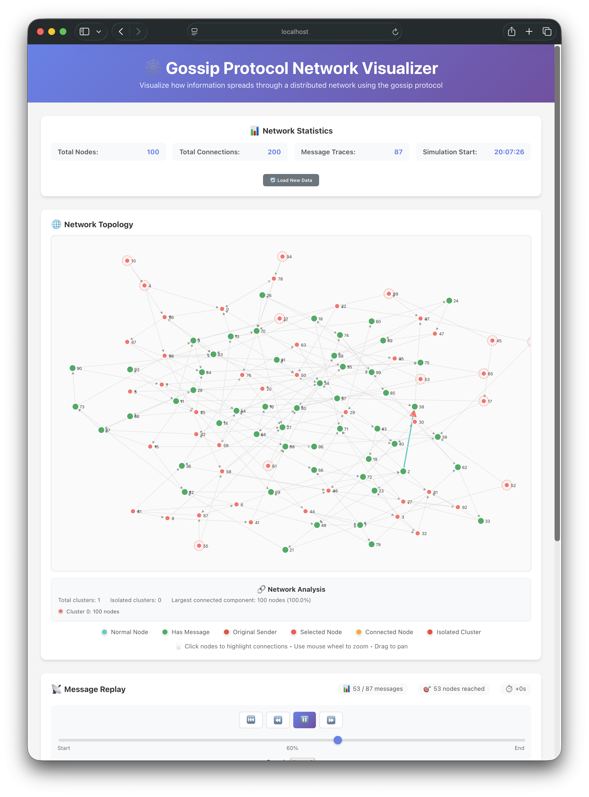

# Introduction 
This tutorial demonstrates how to implement, test, and visualize distributed algorithms using the foundational networking components from from [Tutorial 4](../4-mocking-networks/README.md). We'll implement a **Gossip Protocol** (also called epidemic protocol), which spreads information through a network like rumors in social networks.

## What is a Gossip Protocol?
Gossip protocols are fundamental distributed algorithms that mimic how information spreads in human social networks. Gossip protocols are inspired by how epidemics spread through populations and how rumors propagate in social networks. Just as a person tells a rumor to their friends, who then tell their friends, information in gossip protocols spreads exponentially through a network.

**Corea idea**:
- Each node knows only a few other nodes (its "peers").
- When a node receives new information, it forwards it to all its peers.
- Information spreads exponentially through the network.
- Eventually, most nodes receive the information.

**Epidemic Spreading**:
- Information spreads like a contagious disease.
- Each "infected" node spreads to its "susceptible" neighbors.
- Eventually reaches epidemic proportions across the network.

**Fault Tolerance**:
- No single point of failure.
- Continues working even if nodes fail or messages are lost.
- Self-healing through redundant message paths.

**Scalability**:
- Performance scales logarithmically with network size.
- Low per-node overhead regardless of total network size.
- Naturally load-balanced across all participants.

**Real-world Applications**:
- **Bitcoin**: Transaction propagation across nodes.
- **Cassandra**: Database replication and anti-entropy.
- **Consul**: Service discovery and health checks.
- **Kubernetes**: Cluster state synchronization.

## Algorithm Overview
1. **Random Topology**: Each node connects to 2-3 random peers.
2. **Message Spreading**: Nodes forward messages to all their peers.
3. **Duplicate Prevention**: Nodes track seen messages to avoid loops.
4. **TTL Control**: Messages have a time-to-live to prevent infinite forwarding.
5. **Probabilistic Coverage**: Reaches 80-90% of nodes in well-connected networks.

## Implementation Structure
The implementation is organized across multiple files for clarity:

- **`gossip.go`** - Core gossip protocol (messages, nodes, spreading logic)
- **`builder.go`** - Network topology creation and management 
- **`visualization.go`** - Data export for network analysis and visualization
- **`node.go`** - Basic networking layer (from Tutorial 4)
- **`mock_network.go`** - Mock network implementation (from Tutorial 4)

### Key Components
**1. Gossip Message**
```go
type GossipMessage struct {
    ID        string    `json:"id"`        // Unique identifier
    Content   string    `json:"content"`   // Information being spread  
    Sender    int       `json:"sender"`    // Original sender node
    Timestamp time.Time `json:"timestamp"` // Creation time
    TTL       int       `json:"ttl"`       // Hops remaining
}
```

**2. Gossip Node**
```go
type GossipNode struct {
    id           int
    peers        []Address             // Known peer addresses
    seenMessages map[string]bool       // Prevent message loops
    // ... other fields
}
```

**3. Message Handling Logic**
```go
func (gn *GossipNode) HandleGossipMessage(msg GossipMessage, forwarder int) error {
    // 1. Check if already seen (prevent loops)
    if gn.seenMessages[msg.ID] {
        return nil
    }
    
    // 2. Mark as seen and record
    gn.seenMessages[msg.ID] = true
    gn.receivedMsgs = append(gn.receivedMsgs, msg)
    
    // 3. Forward to peers if TTL allows
    if msg.TTL > 0 {
        msg.TTL--
        go gn.SpreadGossip(msg)  // Forward asynchronously
    }
    return nil
}
```

## Running the Example
**1. Test the Implementation**
```bash
go test -v -run TestGossipProtocol
```

**2. Example Test Code**
```go
func TestGossipProtocol(t *testing.T) {
    // Create mock network and builder
    network := NewMockNetwork()
    builder := NewNetworkBuilder(network)

    // Create 100 nodes, each with 2 random peers
    builder.CreateNodes(100)
    builder.BuildRandomTopology(2)
    builder.StartAllNodes()

    // Start gossip from a random node
    builder.InitiateGossip("Hello from the gossip network!")
    
    // Wait for propagation
    time.Sleep(2 * time.Second)

    // Analyze and export results
    nodes := builder.GetNodes()
    
    // Export data for visualization
    builder.ExportVisualizationData("./visualization")
    builder.CloseAllNodes()
}
```

**3. Example Output**
```bash
$ go test -v -run TestGossipProtocol
=== RUN   TestGossipProtocol
creating 100 gossip nodes...
building random topology (2 peers per node)...
starting 100 nodes...
node 52 starting gossip: 'Hello from the gossip network!'
node 7 received gossip from node 52: 'Hello from the gossip network!'
node 39 received gossip from node 52: 'Hello from the gossip network!'
node 79 received gossip from node 52 (via node 7): 'Hello from the gossip network!'
node 88 received gossip from node 52 (via node 39): 'Hello from the gossip network!'
...

Gossip Results:
- Network size: 100 nodes
- Nodes reached: 87 (87.0%)
- Total messages sent: 176  
- Average messages per node: 1.8
Exported visualization data to ./visualization/network_visualization.json
Total nodes: 100, Total message traces: 87
--- PASS: TestGossipProtocol (2.21s)
```

## Network Visualization
One of the most powerful applications of modern AI tools like Claude and ChatGPT is automated visualization generation. Traditional visualization development can be time-consuming and requires specialized knowledge of graphics libraries and frameworks. However, generative AI has revolutionized this process, enabling developers to create sophisticated visualizations through natural language descriptions.

Debugging distributed algorithms through logs and metrics alone can sometimes be very difficult. Visualization provides crucial insights that are difficult to grasp otherwise:

- **Pattern Recognition**: Spot bottlenecks, partitions, and propagation patterns visually.
- **Algorithm Validation**: Verify that your implementation behaves as theoretically expected.
- **Performance Analysis**: Identify hotspots and inefficient message routing.

Since Go isn't optimized for visualization (lacking rich graphics ecosystems), the recommended approach is:

1. Data Generation in Go: Export simulation data as structured formats (JSON/CSV).
2. AI-Assisted Visualization: Use AI to generate visualization code in web technologies or Python.
3. Interactive Analysis: Load data into the generated visualization for exploration.

This separation of concerns leverages each technology's strengths: Go for robust distributed systems, and JavaScript/Python for rich, interactive visualizations.

## Prompt used
Below is examples of the prompt used to generate the visualization tool in the tutorial. We used Claude Code.

1. "Improve the gossip algorithm to also generate a trace file and topology file. Then develop a React UI to visualize the trace files."
2. "fix the code so that the Test code in gossip_test.go works"
3. "would it be possible to visualize the network using react, the golang save a network.json file and message trace file that can be replayed in React?"
4. "the network topology was very messy, could you cluster the nodes? I also want to see in the network toplogy how messages are propaged?"
5. "would it possible to group all nodes so that it possible to see that some clusters are isolated"
6. "when I click on a node, it shows more than 2 lines, which is wrong"

The result was a fully working visualization tool.



### Using the Visualization
**1. Run the test to generate data:**
```bash
go test -v -run TestGossipProtocol
```

**2. Start the React visualization:**
```bash
cd visualization-react
npm install
npm start
# Open http://localhost:3000
```

**3. Import the generated file:**
Load `./visualization/network_visualization.json` in the React app to see:
- Network topology with directed connections
- Message propagation animation over time
- Cluster analysis showing connected vs. isolated nodes
- Statistics on coverage and message efficiency
